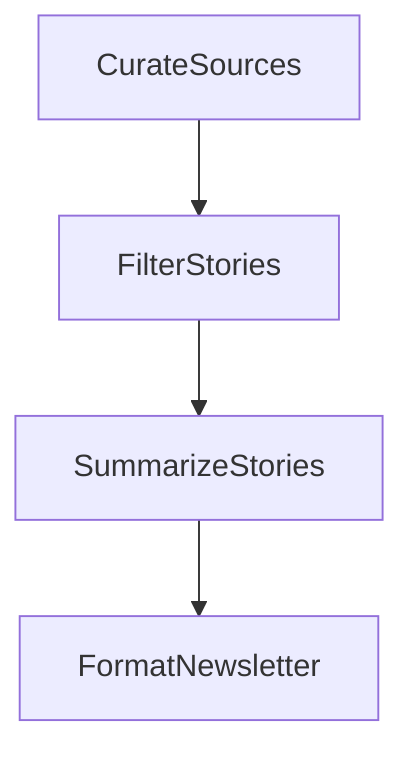

<div align="center" style="border: 2px solid #ccc; padding: 20px; border-radius: 12px; width: 80%; margin: auto; box-shadow: 0 0 10px rgba(0,0,0,0.15);">


<h1 align="center" style="font-family: Arial; font-weight: 600; margin-top: 15px;">SURE ProEd (formerly SURE Trust)</h1>

<h2 style="color: #2b6cb0; font-family: Arial;">Skill Upgradation for Rural youth Empowerment Trust</h2>

</div>

<hr style="border: 0; border-top: 1px solid #ccc; width: 80%;" />

<div style="padding: 20px; border: 2px solid #ddd; border-radius: 12px; width: 90%; margin: auto; background: #fafafa; font-family: Arial;">

<h2 style="color:#333;">Student Details</h2>

<div align="left" style="margin: 20px; font-size: 16px;">

<p><strong>Name:</strong> Prasanna T</p>
<p><strong>Email ID:</strong> prasannathiru05@gmail.com</p>
<p><strong>College Name:</strong> Amet University, chennai</p>
<p><strong>Branch/Specialization:</strong> B.E. CSE(AI&ML)</p>
<p><strong>College ID:</strong> AML23015</p>

</div>

<hr style="border: 0; border-top: 1px solid #ccc; width: 80%;" />

<h2 style="color:#333;">Course Details</h2>

<div align="left" style="margin: 20px; font-size: 16px;">

<p><strong>Course Opted:</strong> Generative AI - Foundation to Applications</p>
<p><strong>Instructor Name:</strong> Mr. Prujith Radhakrishnan</p>

</div>

<div align="left" style="margin: 20px; font-size: 16px;">

<p><strong>Duration:</strong> 6 Months — January 2026 onwards</p>

</div>

<hr style="border: 0; border-top: 1px solid #ccc; width: 80%;" />

<h2 style="color:#333;">Trainer Details</h2>

<div align="left" style="margin: 20px; font-size: 16px;">

<p><strong>Trainer Name:</strong> Mr. Prujith Radhakrishnan</p>
<p><strong>Trainer Email ID:</strong> Not provided</p>
<p><strong>Trainer Designation:</strong> Not provided</p>

</div>

<hr style="border: 0; border-top: 1px solid #ccc; width: 80%;" />

## **Table of Contents**

* [Course Learning](#course-learning)
* [Projects Completed](#projects-completed)
* [Project Introduction](#project-introduction)
* [Technologies Used](#technologies-used)
* [Roles and Responsibilities](#roles-and-responsibilities)
* [Project Report](#project-report)
* [Learnings from LST & SST](#learnings-from-lst--sst)
* [Community Services](#community-services)
* [Certificate](#certificate)
* [Acknowledgments](#acknowledgments)

<hr style="border: 0; border-top: 1px solid #ccc; width: 80%;" />

## **Overall Learning**

During the **Generative AI - Foundation to Applications** course, I gained hands-on experience in understanding and building Generative AI applications using modern AI technologies.

I progressed from foundational concepts to practical implementations through structured assignments and a major capstone project. The internship helped me develop practical knowledge of **Large Language Models (LLMs), prompt engineering, embeddings, semantic search, Retrieval-Augmented Generation (RAG), AI agents, workflow orchestration, API integration, backend development, database integration, and AI application development**.

---

<h2 style="color:#333;">Projects Completed</h2>

<div align="left" style="margin: 20px; font-size: 16px;">

<p><strong><a href="#project1">Project 1:</a></strong> Generative AI Assignments</p>

<p><strong><a href="#project2">Project 2:</a></strong> Finthropic – News Forge AI </p>

</div>

<!-- Project 1 -->

<h3 id="project1">Project 1: Generative AI Assignments</h3>

<p>
During the internship, I completed multiple hands-on assignments covering important areas of Generative AI and LLM application development.
</p>

<p>
The assignments focused on <strong>Chatbots, AI Agents, Semantic Search, and Retrieval-Augmented Generation (RAG)</strong>.
They also provided practical experience with workflow orchestration, embeddings, vector search, external tools, and LLM integration.
</p>

<p><strong>Key concepts covered:</strong></p>

<ul>
<li>Conversational AI and Chatbots</li>
<li>AI Agents and agentic workflows</li>
<li>Semantic Search</li>
<li>Embeddings and vector similarity search</li>
<li>Retrieval-Augmented Generation (RAG)</li>
<li>Workflow orchestration using PocketFlow</li>
<li>External search and LLM integration</li>
</ul>

<p>
<a href="https://github.com/Mridultech/Generative_AI" target="_blank"><strong>→ View Full Project Repository</strong></a>
</p>

<!-- Project 2 -->

<h3 id="project1">Project 1: News Forge – AI Newsletter Engine</h3>

<p>
<strong>News Forge</strong> is an AI-powered newsletter generation system developed during my internship. It automatically searches the web for trending AI topics, filters previously covered stories, generates concise AI-powered summaries, and produces a structured markdown newsletter.
</p>

<p>
The project combines web search, Large Language Models, intelligent story curation, automated summarization, and trend memory into a single workflow for generating fresh AI news digests.
</p>

<p><strong>Key Features:</strong></p>

<ul>
<li>Live web search using DuckDuckGo</li>
<li>LLM-powered news curation and story selection</li>
<li>AI-powered story summarization</li>
<li>Trend memory using <code>history.json</code></li>
<li>Automatic duplicate story filtering</li>
<li>30-day story retention and history management</li>
<li>Custom topic support through CLI arguments</li>
<li>Dual LLM support with Google Gemini and OpenAI</li>
<li>Automatic model fallback for Gemini</li>
<li>Markdown newsletter generation</li>
<li>File-based storage without a database</li>
<li>Modular PocketFlow-based workflow architecture</li>
</ul>

<p>
<a href="<your-repository-url>" target="_blank"><strong>→ View Full Project Repository</strong></a>
</p>

<hr style="height:1px; border-top:1px solid #ccc; width:80%;" />

## **Project Introduction**

The **News Forge** project provided practical exposure to Generative AI, Large Language Models, web search, workflow orchestration, and automated content generation.

The project was designed as an AI newsletter engine that searches for current AI-related topics, evaluates and selects relevant stories, generates concise summaries, and formats them into a readable newsletter.

A key feature of the project is its **trend memory**, which maintains a record of previously covered story URLs and prevents the system from repeatedly selecting the same stories within a 30-day period.

---

## **Technologies Used**

| Category             | Technologies                 |
| -------------------- | ---------------------------- |
| Programming Language | Python                       |
| AI / LLM             | Google Gemini, OpenAI GPT-4o |
| Workflow Framework   | PocketFlow                   |
| Web Search           | DuckDuckGo                   |
| LLM Integration      | Google GenAI, OpenAI API     |
| Data Format          | YAML, JSON, Markdown         |
| Configuration        | Python-dotenv                |
| Version Control      | Git, GitHub                  |
| Storage              | JSON file-based storage      |
| Operating System     | Linux                        |

---

## **Roles and Responsibilities**

During the development of News Forge, I:

* Studied and implemented Generative AI concepts using Large Language Models.
* Developed an AI-powered automated newsletter generation workflow.
* Integrated DuckDuckGo for live web search and news discovery.
* Implemented LLM-based story evaluation and curation.
* Developed logic to identify fresh and relevant stories.
* Implemented AI-powered summarization for selected news articles.
* Designed trend memory using <code>history.json</code>.
* Implemented duplicate story filtering based on previously covered URLs.
* Added automatic 30-day history retention and cleanup.
* Implemented support for custom search topics through CLI arguments.
* Integrated both Google Gemini and OpenAI LLM providers.
* Worked with PocketFlow to structure the processing workflow.
* Designed the application using modular processing nodes.
* Tested and documented the project workflow and implementation.

---

## **Project Workflow**

News Forge follows a four-stage processing pipeline:



| Step | Node               | What it does                                                                                          |
| ---- | ------------------ | ----------------------------------------------------------------------------------------------------- |
| 1    | `CurateSources`    | Searches DuckDuckGo for the configured AI topics and collects raw search results                      |
| 2    | `FilterStories`    | Checks `history.json` and uses the LLM to select fresh stories while avoiding previously covered URLs |
| 3    | `SummarizeStories` | Generates concise 2–3 sentence summaries for the selected stories                                     |
| 4    | `FormatNewsletter` | Combines the generated content into a structured markdown newsletter                                  |

---

## **Trend Memory**

News Forge uses a file-based trend memory system through <code>history.json</code>.

Each time the application runs, previously covered story URLs are loaded and provided to the LLM during the story-selection process. This allows the system to avoid repeatedly selecting stories that have already been included in previous newsletters.

Newly selected stories are automatically added to the history with their coverage date.

The system also removes entries older than **30 days**, allowing genuinely new stories to become eligible for future newsletters.

**Example schema:**

```json
{
  "url": "https://example.com/story",
  "title": "Story headline",
  "date_covered": "2025-07-14"
}
```

---

## **LLM Support**

| Provider      | Model                                                                   | Usage                                        |
| ------------- | ----------------------------------------------------------------------- | -------------------------------------------- |
| Google Gemini | `gemini-2.0-flash-lite`, `gemini-2.0-flash`, `gemini-flash-lite-latest` | Primary LLM provider with automatic fallback |
| OpenAI        | `gpt-4o`                                                                | Alternative LLM provider                     |

The application supports both Google Gemini and OpenAI. Gemini models can automatically fall back to other configured Gemini models when quota-related issues occur.

---

## **Project Structure**

```text
pocketflow-newsletter/
├── .env              ← API keys and environment configuration
├── main.py           ← Application entry point
├── flow.py           ← Connects the workflow nodes
├── nodes.py          ← Core processing nodes and history helpers
├── utils.py          ← LLM and web search utilities
├── history.json      ← Stores previously covered stories
├── Changes.md        ← Changelog and design notes
└── requirements.txt  ← Project dependencies
```

---

## **Default Topics**

The project includes configurable AI-related search topics such as:

```python
TOPICS = [
    "AI agents framework news this week",
    "LLM benchmark results 2025 2026",
    "AI startup funding rounds this month",
]
```

Additional topics can also be supplied dynamically through command-line arguments without modifying the source code.

---

## **Example Output**

The system processes the configured topics, searches the web, selects relevant stories, generates summaries, and produces a structured AI newsletter.

The final output follows a format similar to:

```text
# AI Weekly Digest

## 1. AI Story One
Concise AI-generated summary of the selected story.

## 2. AI Story Two
Concise AI-generated summary of the selected story.

## 3. AI Story Three
Concise AI-generated summary of the selected story.

## 4. AI Story Four
Concise AI-generated summary of the selected story.
```

---

## **Project Report**

The complete project documentation and implementation details are available in the project repository.

<p align="center">
<a href="<your-repository-url>" target="_blank">
<strong>→ View Full Project Repository</strong>
</a>
</p>

---

## **References**

* [Google Gemini](https://ai.google.dev/)
* [OpenAI](https://platform.openai.com/)
* [PocketFlow](https://github.com/The-Pocket/PocketFlow)
* [DuckDuckGo Search](https://duckduckgo.com/)
* [PyYAML](https://pyyaml.org/)
* [python-dotenv](https://github.com/theskumar/python-dotenv)

---

## **Learnings from LST and SST**

LST and SST sessions helped me improve my **communication, confidence, teamwork, presentation skills, professional interaction, and problem-solving abilities**.

These sessions complemented the technical training by helping me understand the importance of effective communication, collaboration, professional behavior, and personal development alongside technical skills.

---

## **Community Services**

During my internship period, I participated in two community-oriented activities involving **food service and tree plantation**.

### **Activities Involved**

* **Food Service** – Participated in a food distribution/service activity as part of community engagement and social responsibility.

* **Tree Plantation Drive** – Participated in a plantation activity and contributed towards environmental improvement and sustainability.

### **Impact / Contribution**

* Contributed to community welfare through food-service activities.
* Participated in an environmental initiative through tree plantation.
* Developed awareness of social responsibility and community participation.
* Improved communication, coordination, and teamwork through community activities.

### **Photos**

<div align="center">


</div>

---

## **Certificate**

The internship certificate serves as official acknowledgment of the successful completion of the training and internship program.

<!-- Add the actual certificate image URL here when available -->

<p align="center">
<strong>Certificate to be added.</strong>
</p>

---

## **Acknowledgments**

I would like to express my sincere gratitude to **SURE ProEd (formerly SURE Trust)** for providing me with the opportunity to gain practical knowledge and hands-on experience in Generative AI.

I am thankful to **Mr. Prujith Radhakrishnan** for his guidance and instruction throughout the **Generative AI - Foundation to Applications** course.

I would also like to acknowledge **GL Bajaj Group Of Institutions, Mathura** for supporting my academic and professional learning journey.

---

## **Author**

**Mridul Goyal**

B.Tech CSE | Generative AI | AI Engineering Enthusiast

* **GitHub:** https://github.com/Mridultech
* **LinkedIn:** https://linkedin.com/in/mridul-goyal-7221581b3
* **Email:** [mridul.goyalg4genai@gmail.com](mailto:mridul.goyalg4genai@gmail.com)
